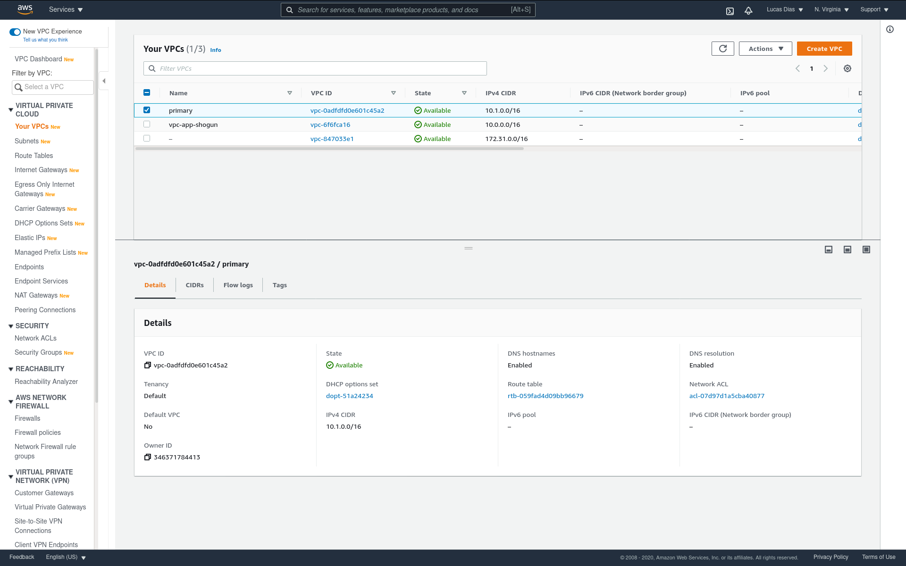
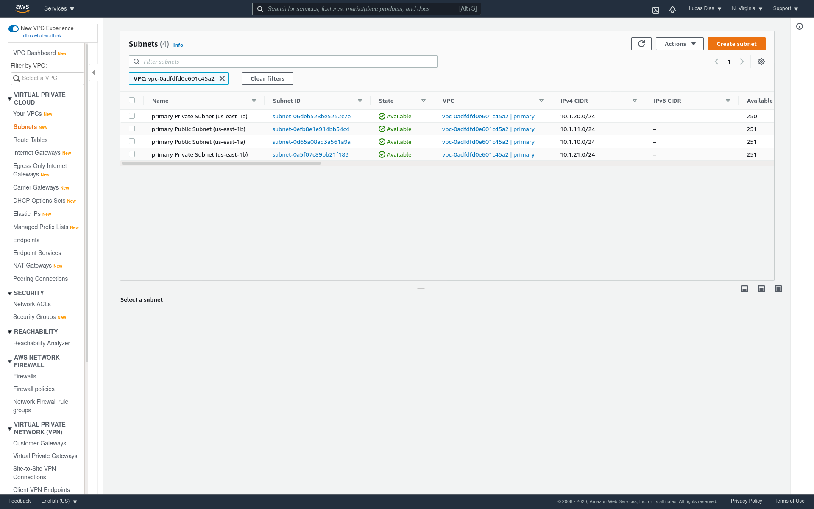
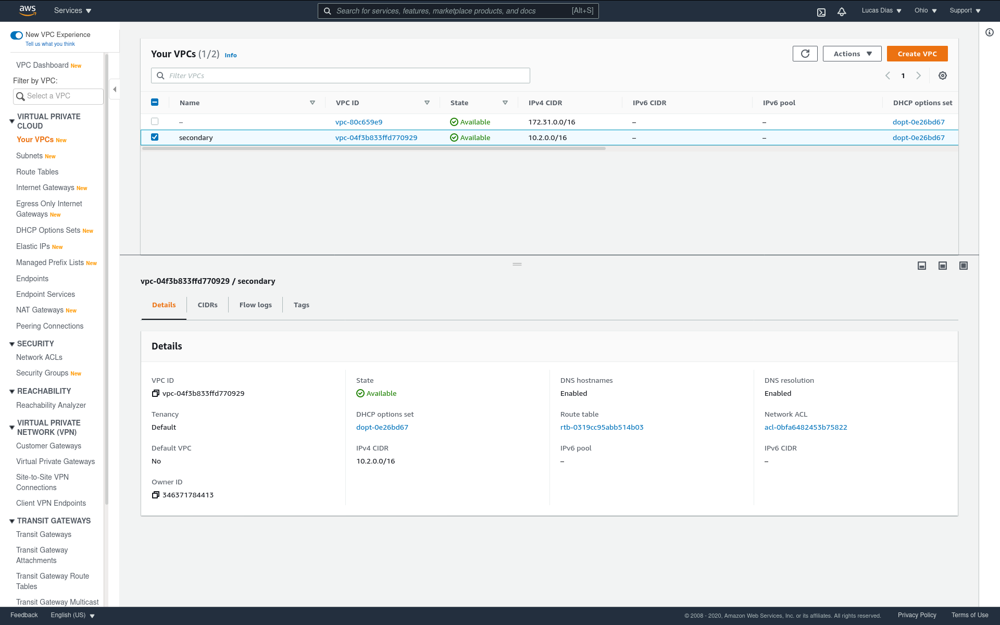
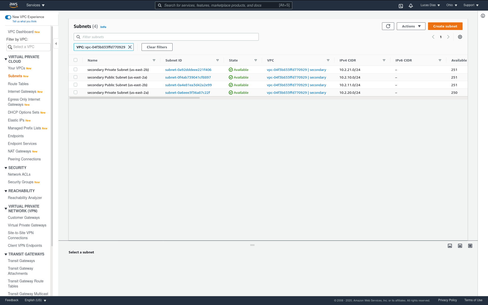
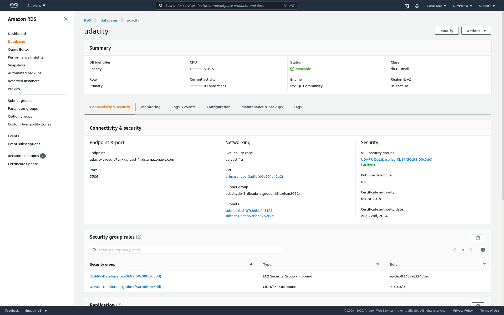
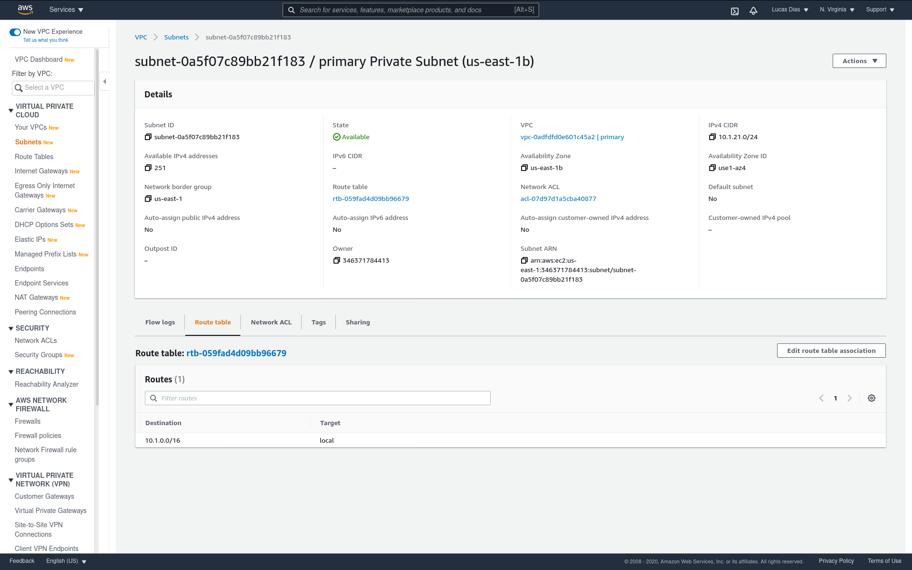
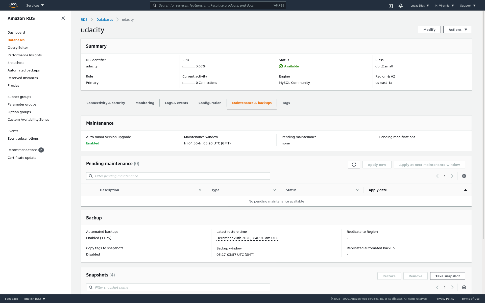
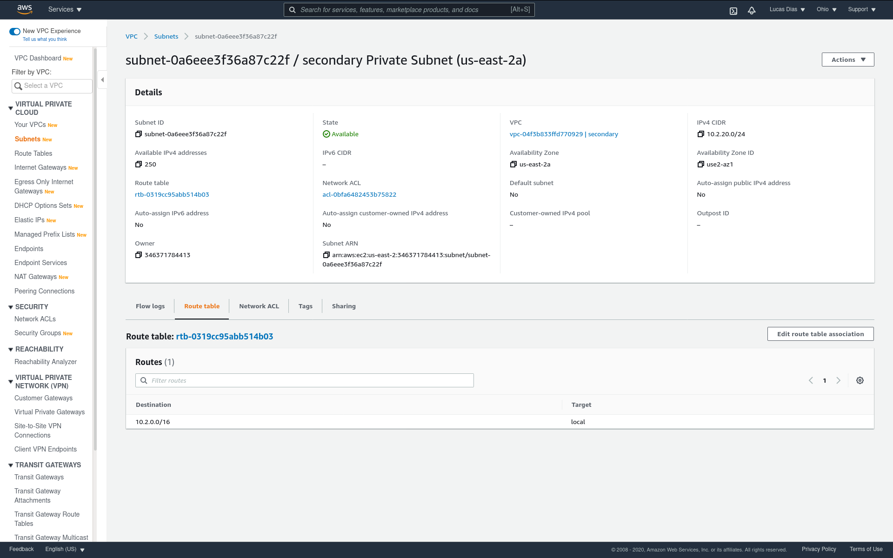
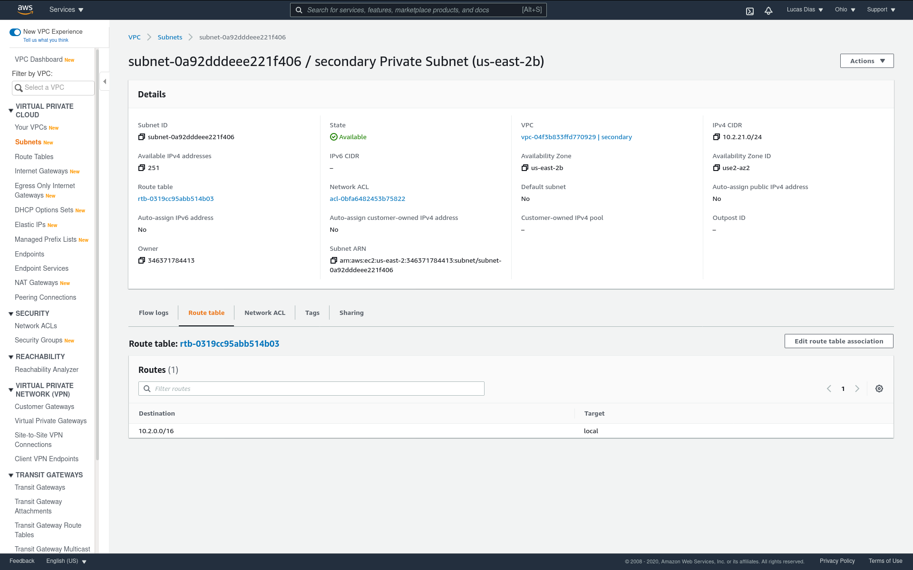

# udacity-aws-cloud-architect-project1-recoverability-in-aws

## Relational Database Resilience

### SWBAT build networks that will continue to operate through the loss of a single data center

Primary VPC located in us-east-1:

Secondary VPC located in us-east-2:

### SWBAT build systems that align to a business availability objectives for redundancy.
The primary DB is running in us-east-1. It is running on subnets "06d" and "0a5", which are thw two private subnets.

These are the private subnets route tables. Traffic is restricted.

Automated backup is configured once a day:

### SWBAT build systems that align to business availability objectives for resiliency.
The secondary DB is running in us-east-2.

It is configured as a read replica from the primary DB.

These are the private subnets route tables. Traffic is restricted.

