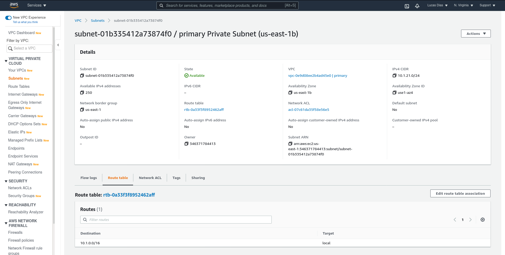

# udacity-aws-cloud-architect-project1-recoverability-in-aws

You can run `./project1-vpc-rds.sh` to deploy the VPCs and RDSs.

## Relational Database Resilience

### SWBAT build networks that will continue to operate through the loss of a single data center

Primary VPC located in us-east-1:

Secondary VPC located in us-east-2:

### SWBAT build systems that align to a business availability objectives for redundancy.
The primary DB is running in us-east-1. It is running on subnets "01b" and "071", which are the two private subnets.

These are the private subnets route tables. Traffic is restricted. (primary subnet routing)

It has a Multi AZ deployment.

Automated backup is configured once a day.

### SWBAT build systems that align to business availability objectives for resiliency.
The secondary DB is running in us-east-2.

It is configured as a read replica from the primary DB.

These are the private subnets route tables. Traffic is restricted. (secondary subnet routing)

## Manage applications in AWS
### SWBAT predict the availability of a configuration
See [estimates](./submission/estimates.txt)

### SWBAT use correct data access patterns.
See [log primary](./submission/log_primary.png) and [log secondary](./submission/log_rr_before_promotion.png) for connection logs to primary and secondary db.

### SWBAT monitor highly available system
See [monitoring connections](./submission/monitoring_connections.png) and [monitoring replication](./submission/monitoring_replication.png) for monitoring metrics.

### SWBAT operate a highly resilient database
See [before promotion](./submission/rr_before_promotion.png) and [after promotion](./submission/rr_after_promotion.png) for before/after promotion configuration. See [log after promotion](./submission/log_rr_after_promotion.png) for connection after promotion with write requests.

## Website recovery
### SWBAT create a versioned website
I have used the commands in `project1-static-site.sh` and the cloudformation stack `s3_site.yaml` to setup the static site.

### SWBAT recover from “accidental” modification to website
I have used the commands in `project1-static-site-error.sh` to delete and recover the objects.

After accidental change:

After recovery:

Accidental deletion:

After recovery:

